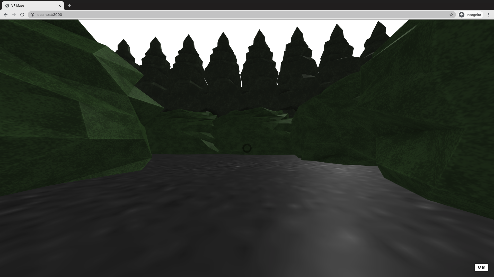
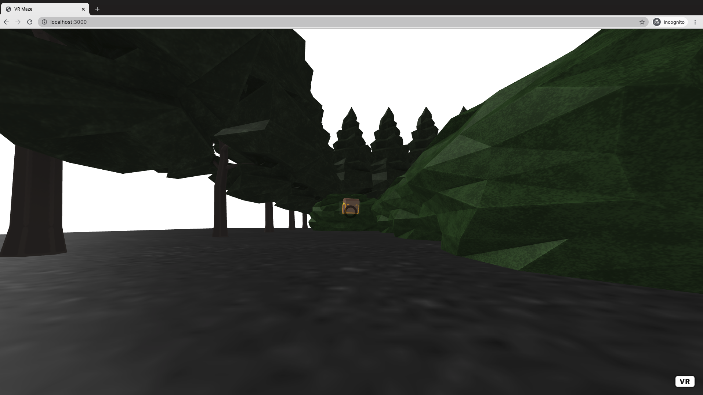

# Virtual Reality Maze 
## NYU CSCI-UA 380 Interactive Computing, Fall 2019 Final Project 

* Created by Seulmin Ryu and Woo Park 
* Under the guidance of Professor [Craig Kapp](https://cims.nyu.edu/~kapp/) 

Implemented using **A-Frame, p5.js, and Node.js**.


## Instructions
1. Open Terminal. 
2. Naviage to the repository. 
3. Install dependencies and start server. 
```
$ npm install 
$ npm start
```
4. Go to localhost:3000, and start playing!

## Screenshots






Good Luck!
